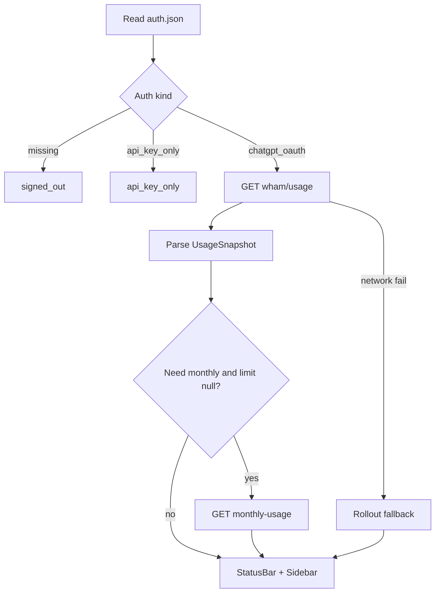

# ChatGPTVisual — plan hoàn chỉnh (v0.1)

Extension VS Code **standalone** hiện usage tài khoản ChatGPT đã login qua `openai.chatgpt`.
Thiết kế từ đầu cho ChatGPT/Codex; **không tham chiếu / không phụ thuộc** ClaudeVisual.

Hiển thị đủ: cửa sổ rate-limit, **flexible usage credits**, và **hạn mức credits/spend tháng**
(Team workspace + EDU admin cap).

## Decisions locked

- Product: extension riêng (`chatgptvisual/`), không fork ClaudeVisual.
- Scope v0.1: account usage only (status bar + sidebar) — không session tree / advisor / hooks.
- Auth: ChatGPT OAuth via `~/.codex/auth.json` (shared với extension ChatGPT).
- Credits tháng: Team `spend_control.individual_limit` + EDU/Enterprise fallback
  `.../spend-controls/current-user/monthly-usage`.

## Nguồn dữ liệu (thứ tự)

1. **Auth:** `$CODEX_HOME/auth.json` (default `~/.codex/auth.json`) —
   `tokens.access_token`, `tokens.account_id`.
2. **Primary API:** `GET https://chatgpt.com/backend-api/wham/usage`  
   Headers: `Authorization: Bearer <access_token>`, `ChatGPT-Account-Id: <account_id>`,
   `Accept: application/json`.
3. **Monthly fallback (khi cần):** nếu `plan_type` là team/education/enterprise **và**
   `spend_control.individual_limit` null **và** không có `credits.balance` hữu ích →  
   `GET https://chatgpt.com/backend-api/accounts/{account_id}/spend-controls/current-user/monthly-usage`  
   Map: `current_month_usage` / `effective_monthly_limit.limit` → monthly meter.
4. **Offline fallback:** scan `~/.codex/sessions/**/rollout-*.jsonl` gần nhất lấy
   `rate_limits` / `x-codex-*` credit fields nếu có.

`source` setting: `auto` (default) | `api` | `rollout`.

## Model thống nhất

```ts
interface RateWindow {
  usedPercent: number;       // 0–100
  windowSeconds?: number;    // label theo duration, không tin tên primary/secondary
  resetsAt?: number;         // unix sec
}

interface FlexibleCredits {
  hasCredits: boolean;
  unlimited: boolean;
  balance?: string;          // chỉ khi hasCredits && balance present
  overageLimitReached?: boolean;
}

interface MonthlySpend {
  limit: number;
  used: number;
  remaining?: number;
  usedPercent: number;
  resetsAt?: number;
  source: "spend_control" | "monthly_usage_api";
  enforcementMode?: string;  // e.g. HARD_CAP
}

interface UsageSnapshot {
  planType?: string;
  email?: string;
  windows: RateWindow[];           // 0–N, sorted by windowSeconds asc
  codeReview?: RateWindow;         // optional riêng
  credits?: FlexibleCredits;
  monthly?: MonthlySpend;          // Team/EDU monthly budget
  allowed?: boolean;
  limitReached?: boolean;
  spendControlReached?: boolean;
  promoMessage?: string;
  resetCreditsAvailable?: number;
  source: "api" | "rollout";
  capturedAt: number;
  status: "ok" | "signed_out" | "api_key_only" | "error" | "disabled" | "polling";
  error?: string;
}
```

Label cửa sổ theo `limit_window_seconds`: ~3h/5h → `5h` (hoặc `3h` nếu gần 10800),
~7d → `7d`, khác → `Xh` / `Xd`. **Không** giả định primary=5h.

## Ma trận trường hợp (đủ cho v0.1)

### Auth / môi trường

| Case | Hành vi |
| --- | --- |
| Đã ChatGPT OAuth, có `auth.json` | Poll bình thường |
| Chưa login / thiếu file | Status `signed_out` — “Sign in to the ChatGPT extension” |
| Chỉ API key trong auth (không `account_id` / không ChatGPT session) | `api_key_only` — wham/usage không dùng được; hướng dẫn Sign in with ChatGPT |
| Token hết hạn (401) | `signed_out` / error rõ; **không** tự refresh OAuth |
| Credentials chỉ trong OS keyring (không file) | v0.1: coi như signed_out + note README cần file store / mở ChatGPT extension để ghi lại auth; không đọc keyring |
| `$CODEX_HOME` / setting `codexHome` | Tôn trọng override path |

### Rate windows

| Case | Hành vi |
| --- | --- |
| Plus/Pro đủ 5h + 7d | Hiện cả hai |
| Chỉ một window (primary hoặc secondary null) | Hiện window còn lại; không invent 100% cho slot thiếu |
| Team: primary = 7d, secondary null | Label theo duration (`7d`), không gọi nhầm `5h` |
| `allowed=false` / `limit_reached=true` | Warn trên bar + sidebar “limit reached” |
| `code_review_rate_limit` có data | Sidebar only (không nhồi status bar) |
| `promo` message | Tooltip / sidebar footer |

### Flexible usage credits (personal Plus/Pro mua credits)

| Case | Hành vi |
| --- | --- |
| `has_credits=false` | Sidebar: “No usage credits”; bar chỉ windows |
| `has_credits=true`, `balance` có (vd `"5.39"`) | Bar thêm `· $5.39`; sidebar khối Credits nổi |
| `unlimited=true` | Bar `· credits ∞`; không warn hết credit |
| Windows ~100% + còn credits | Note: đang dùng credits sau included usage |
| `overage_limit_reached=true` | Warn riêng |
| `balance` null dù `has_credits=true` | Không hiện `$0` giả; dựa vào monthly nếu có |

### Monthly credits / spend (credits tháng)

| Case | Nguồn | UI |
| --- | --- | --- |
| Team: `spend_control.individual_limit` có limit/used/% | wham/usage | Bar: `· monthly 4%` (hoặc `$used/$limit`); sidebar meter tháng + reset |
| `spend_control.reached=true` | wham/usage | Warn / blocked |
| EDU/Enterprise: `individual_limit` null | monthly-usage API | Cùng meter monthly; `source=monthly_usage_api` |
| Personal không có monthly cap | — | Không hiện khối monthly |

Quy tắc gộp status bar (ưu tiên gọn):

`GPT [<windows…>] [· $balance | · credits ∞] [· monthly N%]`

Warn khi: bất kỳ window ≥ `warnPercent`, **hoặc** monthly `usedPercent` ≥ `warnPercent`,
**hoặc** flexible balance < `creditsWarnBalance`, **hoặc** limit/spend reached / overage.

### Ngoài phạm vi v0.1 (ghi rõ, không làm)

- Session list / token-per-chat / advisor / hook vào `openai.chatgpt`
- Đọc OS keyring
- OpenAI Platform Billing API (API-key $ spend theo ngày) — user phải Sign in with ChatGPT
- Mua credits / deep-link thanh toán (chỉ link mở Settings Usage nếu có URL ổn định)
- Multi-account switcher

## UI

- **Status bar (Right):** text gộp như trên; click = refresh; tooltip chi tiết plan, reset,
  nguồn, credits, monthly.
- **Sidebar (1 view):** plan + email (nếu có) → windows → **Usage credits** →
  **Monthly spend** (ẩn nếu không có) → code review (nếu có) → footer nguồn/time.
- Commands: `ChatGPTVisual: Refresh Usage`
- Settings: `enabled`, `pollIntervalMinutes` (5), `warnPercent` (90),
  `creditsWarnBalance` (1), `codexHome`, `source`

## Kiến trúc

```text
chatgptvisual/
├── package.json
├── src/
│   ├── extension.ts
│   ├── core/
│   │   ├── auth.ts
│   │   ├── usage-client.ts      # wham/usage + monthly-usage
│   │   ├── usage-rollout.ts
│   │   ├── usage-model.ts       # parse → UsageSnapshot
│   │   └── usage-poller.ts
│   ├── ui/
│   │   ├── status-bar.ts
│   │   └── sidebar/
│   └── log.ts
└── test/fixtures/               # JSON payloads theo matrix
```



Quy tắc vận hành:

- Poll chỉ khi VS Code window focused; timeout ~10s; không spam (< 1 request/phút khi auto).
- Không ghi credential; không log token.
- Không inject extension ChatGPT.

## Implementation todos

1. Scaffold `chatgptvisual/` package độc lập (package.json, tsconfig, esbuild, extension entry)
2. Auth reader (`auth.json` + API-key detect) + wham/usage + monthly-usage fallback + rollout offline
3. `UsageSnapshot` parser: windows theo duration, credits, spend monthly, code_review, promo, overage
4. Poller focus-gated + status bar + sidebar cho mọi case (plan-only, credits, monthly, blocked)
5. Fixtures đủ matrix case + README privacy/manual checklist

## Fixtures / tests (bắt buộc)

1. Plus plan-only (`has_credits=false`, 5h+7d)
2. Pro + flexible balance
3. Unlimited credits
4. Windows 100% + còn balance
5. Primary null / secondary only
6. Team `spend_control.individual_limit` (balance null)
7. EDU-style: wham không có monthly → monthly-usage fixture
8. API-key-only auth fixture
9. 401 / empty body
10. Rollout JSONL rate_limits sample

## README

- Yêu cầu Sign in **ChatGPT** (không phải API key) trong extension ChatGPT.
- Giải thích: included windows → flexible credits → monthly workspace/EDU cap.
- Token nhạy cảm; endpoint nội bộ có thể đổi.
- Keyring-only: hạn chế v0.1.

## Definition of done v0.1

- Package build/typecheck/test xanh với fixtures trên.
- Manual: login ChatGPT extension → bar hiện windows; acc có credits → `$…`;
  Team/EDU fixture path được unit-cover; logout → sign-in state.
