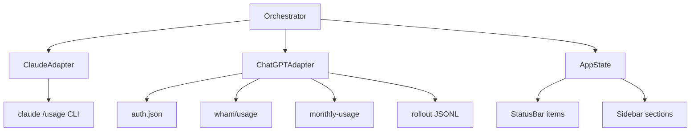

# DualUsage — plan hoàn chỉnh (v0.1)

Extension VS Code **greenfield**: một extension hiện account usage cho **cả Claude và ChatGPT**, khi user đã đăng nhập companion tools tương ứng.

Thiết kế **từ đầu**. Không reuse, không phụ thuộc, không tham chiếu implementation của bất kỳ extension usage hiện có trong repo này hay repo khác — chỉ dựa trên public/local surfaces của từng nhà cung cấp.

Tên làm việc: **DualUsage** (có thể đổi khi publish: `aiusagelimits`, `modelbudget`, …).

## Decisions locked

- Một extension, **hai provider độc lập** (Claude + ChatGPT), cùng một UI shell.
- Scope v0.1: **account usage / rate limits / credits** trên status bar + sidebar — không session tree, không token-per-chat, không advisor, không hook/inject vào companion extensions.
- Mỗi provider có adapter riêng; core chỉ biết `ProviderSnapshot` thống nhất.
- Provider vắng mặt / chưa login → ẩn hoặc hiện “Sign in …”, **không** chặn provider kia.
- Không đọc OS keyring trong v0.1 (chỉ file credential local đã biết).

## Sản phẩm phụ thuộc (login, không inject)

| Provider | Companion login | Credential local (file) |
| --- | --- | --- |
| Claude | Claude Code CLI hoặc extension Anthropic đã sign-in | `~/.claude/` session / OAuth material mà CLI đã dùng cho `/usage`, **hoặc** gọi headless `claude -p --no-session-persistence /usage` (không tự quản lý token) |
| ChatGPT | Extension `openai.chatgpt` / Codex login | `~/.codex/auth.json` (`$CODEX_HOME`) — `tokens.access_token` + `tokens.account_id` |

Extension này **chỉ đọc** (hoặc spawn CLI usage) — không ghi credential, không refresh OAuth hộ user.

## Kiến trúc (greenfield)

```text
dualusage/
├── package.json
├── src/
│   ├── extension.ts                 # activate: register UI + start orchestrator
│   ├── domain/
│   │   ├── types.ts                 # ProviderId, RateWindow, Credits, MonthlySpend, ProviderSnapshot
│   │   └── format.ts                # label window by duration; status-bar string rules
│   ├── providers/
│   │   ├── types.ts                 # ProviderAdapter interface
│   │   ├── registry.ts              # enabled adapters from settings
│   │   ├── claude/
│   │   │   ├── adapter.ts
│   │   │   ├── cli-usage.ts         # spawn `claude … /usage`
│   │   │   └── parse-cli-text.ts    # parse plain-text report → windows
│   │   └── chatgpt/
│   │       ├── adapter.ts
│   │       ├── auth.ts              # read auth.json; detect oauth vs api_key_only
│   │       ├── wham-client.ts       # GET wham/usage
│   │       ├── monthly-client.ts    # GET …/monthly-usage when needed
│   │       ├── parse-wham.ts
│   │       └── rollout-fallback.ts  # optional offline ~/.codex/sessions
│   ├── runtime/
│   │   ├── orchestrator.ts          # parallel poll, merge → AppState
│   │   └── scheduler.ts             # focus-gated interval, manual refresh
│   ├── ui/
│   │   ├── status-bar.ts            # one item per enabled provider (or compact dual)
│   │   └── sidebar/                 # sections stacked: Claude | ChatGPT
│   └── log.ts                       # never log secrets
└── test/
    └── fixtures/
        ├── claude-usage-*.txt
        └── chatgpt-wham-*.json
```



### ProviderAdapter (contract)

```ts
interface ProviderAdapter {
  readonly id: "claude" | "chatgpt";
  readonly label: string;
  fetch(ctx: FetchContext): Promise<ProviderSnapshot>;
}
```

Core không biết URL Claude hay ChatGPT — chỉ gọi `fetch` và render `ProviderSnapshot`.

## Domain model thống nhất

```ts
type ProviderId = "claude" | "chatgpt";

interface RateWindow {
  usedPercent: number;
  windowSeconds?: number;
  resetsAt?: number;
  resetsLabel?: string; // Claude CLI often prints human label
}

interface FlexibleCredits {
  hasCredits: boolean;
  unlimited: boolean;
  balance?: string;
  overageLimitReached?: boolean;
}

interface MonthlySpend {
  limit: number;
  used: number;
  remaining?: number;
  usedPercent: number;
  resetsAt?: number;
  source: "spend_control" | "monthly_usage_api";
  enforcementMode?: string;
}

interface ProviderSnapshot {
  provider: ProviderId;
  planType?: string;
  email?: string;
  windows: RateWindow[];
  codeReview?: RateWindow;
  credits?: FlexibleCredits;      // ChatGPT flexible credits; Claude may omit
  monthly?: MonthlySpend;         // Team/EDU ChatGPT; Claude may omit
  allowed?: boolean;
  limitReached?: boolean;
  spendControlReached?: boolean;
  promoMessage?: string;
  source: "cli" | "api" | "rollout";
  capturedAt: number;
  status:
    | "ok"
    | "disabled"
    | "signed_out"
    | "api_key_only"
    | "cli_missing"
    | "error"
    | "polling";
  error?: string;
}

interface AppState {
  claude?: ProviderSnapshot;
  chatgpt?: ProviderSnapshot;
}
```

Label cửa sổ theo `windowSeconds` (≈3h/5h/7d) — không hard-code tên slot provider.

## Claude adapter

**Cách lấy số (v0.1, chọn một đường chính):**

1. Spawn headless: `claude -p --no-session-persistence /usage` (binary từ PATH hoặc setting `claudePath`).
2. Parse plain text các dòng dạng `% used` / resets (session ≈ 5h, week ≈ 7d, optional model-specific week lines).
3. Không đọc/ghi credential Anthropic trực tiếp — nhờ CLI đã login.

**Trạng thái đặc thù:**

| Case | Status / UI |
| --- | --- |
| CLI không có trên PATH | `cli_missing` |
| CLI chạy nhưng không parse được / unsigned | `signed_out` hoặc `error` |
| Có 5h + 7d | Hiện cả hai |
| Chỉ một cửa sổ | Hiện cái có; không bịa slot kia |
| Setting `providers.claude.enabled=false` | `disabled`, ẩn bar Claude |

**Không làm v0.1 (Claude):** gọi trực tiếp Anthropic OAuth usage HTTP (trừ khi sau này thêm như optional path); session JSONL; account spend enterprise ngoài `/usage`.

## ChatGPT adapter

**Thứ tự fetch:**

1. Đọc `$CODEX_HOME/auth.json` → phân loại: missing | `api_key_only` | `chatgpt_oauth`.
2. `GET https://chatgpt.com/backend-api/wham/usage` với Bearer + `ChatGPT-Account-Id`.
3. Nếu team/education/enterprise và thiếu monthly trong payload →  
   `GET …/accounts/{id}/spend-controls/current-user/monthly-usage`.
4. Network fail → rollout JSONL offline (nếu `source=auto|rollout`).

**Ma trận (rút gọn — đủ v0.1):**

| Case | Hành vi |
| --- | --- |
| OAuth OK | Windows + credits + monthly nếu có |
| API key only | `api_key_only` — yêu cầu Sign in with ChatGPT |
| 401 | `signed_out` — không tự refresh token |
| Flexible credits `balance` | Bar `· $x.xx` |
| `unlimited` | `· credits ∞` |
| Team `spend_control.individual_limit` | Monthly meter |
| EDU monthly chỉ trên monthly-usage API | Fallback call |
| Window null | Bỏ slot; label theo duration |
| Keyring-only (không file) | `signed_out` + README |

## UI

### Status bar

Hai item Right (thứ tự setting), hoặc một item compact nếu `statusBar.style=compact`:

- Claude: `Claude 5h 32% · 7d 14%`
- ChatGPT: `GPT 5h 32% · 7d 14% · $5.39` / `· monthly 4%`

Click từng item → refresh provider đó (hoặc cả hai). Tooltip: plan, resets, credits, monthly, nguồn, tuổi dữ liệu.

Warn background theo `warnPercent` / `creditsWarnBalance` **per provider**.

### Sidebar

Một webview, hai section độc lập (Claude trên / ChatGPT dưới — hoặc theo setting order). Section ẩn khi provider disabled. Mỗi section: plan → windows → credits → monthly → footer.

### Commands / settings

- `DualUsage: Refresh All`
- `DualUsage: Refresh Claude`
- `DualUsage: Refresh ChatGPT`
- `dualusage.providers.claude.enabled` (true)
- `dualusage.providers.chatgpt.enabled` (true)
- `dualusage.pollIntervalMinutes` (5)
- `dualusage.warnPercent` (90)
- `dualusage.creditsWarnBalance` (1)
- `dualusage.claudePath` ("")
- `dualusage.codexHome` ("")
- `dualusage.chatgpt.source` (`auto`|`api`|`rollout`)
- `dualusage.statusBar.style` (`split`|`compact`)

## Runtime

- Orchestrator poll **song song** hai adapter khi đến interval; chỉ khi window focused.
- Timeout per provider (~10s ChatGPT HTTP; Claude CLI có thể dài hơn, cap hợp lý).
- Lỗi một provider không làm mất snapshot cũ của provider kia.
- Manual refresh bỏ qua focus gate.

## Bảo mật

- Không log access token / raw auth.json / CLI env secrets.
- Không ghi `auth.json` / Claude credentials.
- Không inject hooks vào Claude Code hay `openai.chatgpt`.
- Document: endpoint ChatGPT nội bộ có thể đổi; Claude phụ thuộc format `/usage`.

## Ngoài phạm vi v0.1

- Session / transcript / token economics / advisor
- Multi-account switcher
- OS keyring
- OpenAI Platform Billing (API-key daily $)
- Gemini / Copilot providers (architecture cho phép thêm adapter sau)
- ~~Cursor provider~~ → shipped in DualUsage 0.2 (local `state.vscdb` + Dashboard API)
- Mua credits / checkout flows

## Fixtures / tests

**Claude**

1. Full 5h + 7d text
2. Session-only / week-only
3. ANSI-colored output
4. Empty / unparseable → undefined windows
5. cli_missing simulation (unit mock)

**ChatGPT**

1. Plus plan-only
2. Pro + flexible balance
3. Unlimited credits
4. Windows full + balance
5. Single window (other null)
6. Team `spend_control.individual_limit`
7. EDU monthly-usage fallback
8. api_key_only auth
9. 401 / empty body
10. Rollout sample

**Orchestrator**

1. Claude ok + ChatGPT signed_out → UI vẫn hiện Claude
2. ChatGPT ok + Claude cli_missing → UI vẫn hiện GPT
3. Both disabled → no status items

## README (nội dung bắt buộc)

- Cài Claude Code (signed in) và/hoặc ChatGPT VS Code extension (Sign in with ChatGPT).
- Bật/tắt từng provider.
- Included windows vs flexible credits vs monthly Team/EDU.
- Privacy: credentials local, không upload.
- Hạn chế keyring-only và undocumented ChatGPT endpoints.

## Implementation todos

1. Scaffold `dualusage/` package (package.json, tsconfig, esbuild, activate stub)
2. Domain types + format helpers + ProviderAdapter registry
3. Claude adapter: CLI spawn + text parse + fixtures
4. ChatGPT adapter: auth, wham, monthly, rollout, fixtures
5. Orchestrator + scheduler (parallel, focus-gated)
6. Status bar (split/compact) + sidebar sections
7. Settings/commands + README + manual checklist

## Definition of done v0.1

- Build / typecheck / unit tests xanh trên toàn bộ fixtures trên.
- Manual: chỉ Claude login → chỉ bar Claude; chỉ ChatGPT login → chỉ bar GPT; cả hai → hai section; tắt một provider trong settings → biến mất khỏi UI.
